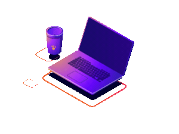

<h1 align="center">
  Hi there  I'm Mohammadreza
</h1>

🚀 Web Developer specialized in Laravel & WordPress  
🎯 Constantly learning and exploring new technologies  

---

## 🧠 About Me

- 💻 Passionate about backend development with **PHP** and **Laravel**  
- 🌐 Experienced in building websites with **WordPress**  
- 🎨 Skilled in frontend development using **HTML**, **CSS**, **Bootstrap**, and **Tailwind CSS**  
- 🛠 Familiar with **Git** and collaborative workflows  
- 🗄 Confident in managing **MySQL** databases  
- 🖌 Also love working with **Photoshop** for UI/UX designs  
- 📚 Lifelong learner who enjoys growing through new challenges  

---

  

  <b>I turn coffee ☕ into code 👨‍💻</b> 
  <i>PHP | Laravel | WordPress | Tailwind | Livewire</i>

---
## 🧰 Skills

---

## 📈 GitHub Stats

  

---

## 🏅 Certifications

- ✅ [Git & GitHub](https://github.com/Mohammadrezaj6/Mohammadrezaj6/blob/main/Certificates/github-certificate.jpeg)
- ✅ [Css](https://github.com/Mohammadrezaj6/Mohammadrezaj6/blob/main/Certificates/css-certificate.jpg)

---

## 📫 Contact Me

- 📧 [Email](mamareza.j6@gmail.com)  
- 🌐 [Website](https://webdsignr.ir/)  
- 💼 [LinkedIn](https://www.linkedin.com/in/mohammadreza-j-27391a30a/)

